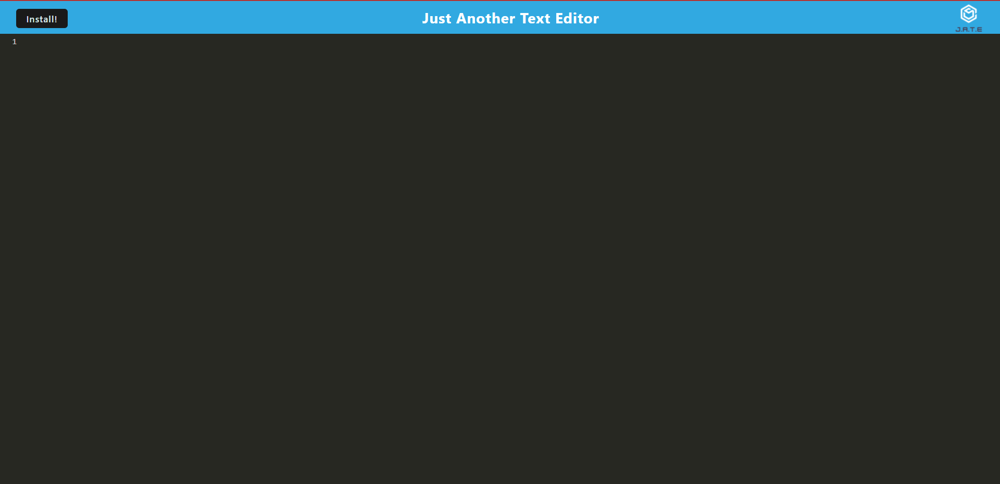
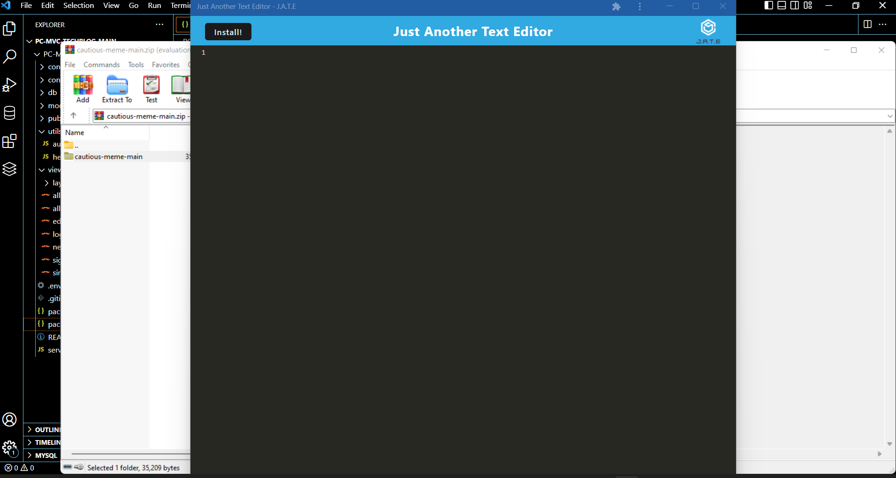
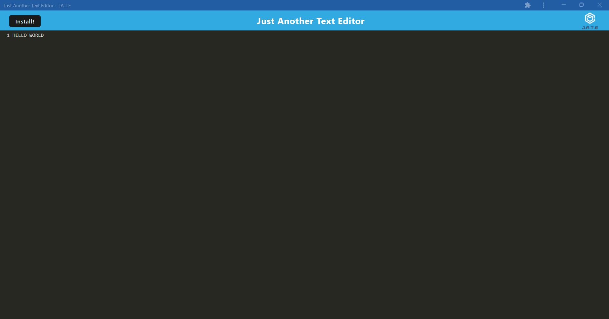

# Progressive Web Applications (PWA) Challenge: Text Editor

To build this text editoy, you will satrt with an existing application and implement methods for getting and storing data to
an IndexedDB API. It features a number of methods taht are useful for soring and retrieving data, and is used by companies like Google and Mozilla. 

## Screenshot

## Deployed Link

